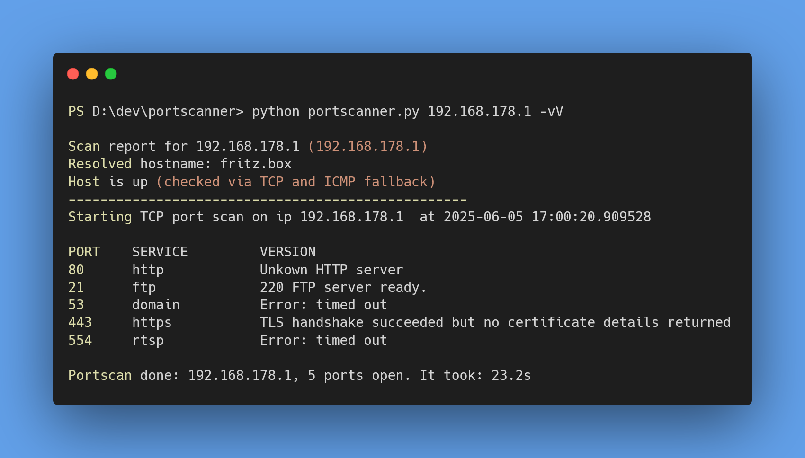

# Simple TCP/UDP Port Scanner

A lightweight, multi-threaded TCP and UDP port scanner with banner grabbing, host detection and port profile support. Designed for fast network reconnaissance with helpful service version detection and network-wide scanning.

---

## 🌟 Features

- TCP and UDP port scanning
- Banner grabbing for common services (HTTP, FTP, SSH, SMTP, MySQL, Redis, TLS cert info on HTTPS)
- Host availability check (TCP + ICMP ping fallback)
- Named port profiles (`web`, `mail`, `ftp`, `db`, `all`)
- Multi-threaded scanning with thread limiting to avoid overload
- Scan a full `/24` network prefix with a single flag
- Verbose output and service version detection
- Graceful shutdown on user interrupt

---

## 🔧 Usage

```bash
~$ python .\portscanner.py -h
usage: portscanner.py [-h] [-u] [-p PORT] [-P PROFILE] [-v] [-V] [-n] ip

Simple threaded TCP/UDP port scanner with banner grabbing and host detection.

positional arguments:
  ip          IP address or network prefix to scan

options:
  -h, --help  show this help message and exit
  -u          Enable UDP scan instead of TCP (default: False)
  -p PORT     Port or port range (e.g. 80 or 80-443) (default: None)
  -P PROFILE  Named port profile (web, mail, ftp, db, all) (default: None)
  -v          Enable verbose output (default: False)
  -V          Attempt to detect service versions (default: False)
  -n          Scan a /24 network instead of a single host (default: False)
```

## 📜 Examples
- Scan a single host's common TCP ports (1-1023):
```bash
python portscanner.py 192.168.1.10
```

- Scan a single host's ports 80 to 443 with version detection:
```bash
python portscanner.py 192.168.1.10 -p 80-443 -V
```

- Scan the entire 192.168.1.x subnet on UDP port 53:
```bash
python portscanner.py 192.168.1 -n -u -p 53
```

- Scan using a named profile for web ports:
```bash
python portscanner.py 192.168.1.10 -P web
```

- Verbose UDP scan on a single host:
```bash
python portscanner.py 8.8.8.8 -v -u
```

## 🧰 Installation
Requires Python 3.6+
<br/>
No external dependencies are needed (uses only standard library)
<br/>
Clone the repository or download the `portscanner.py` script.

## Author
Created with ♥️ by [Max Schäfer](https://github.com/maxi-schaefer)
